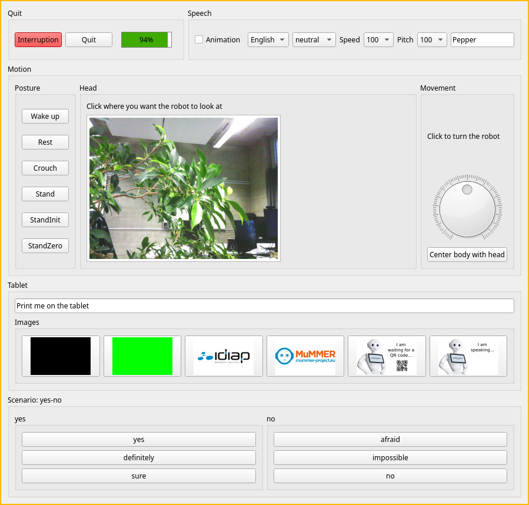

# Idiap Robot Toolkit

A toolkit to handle robots with Python.

## Installation

When using Qt6 through PySide6, install it with conda:

```bash
(base) $ conda create -y -n irt python=3.11 pip pyside6
```

and then

```bash
pip install -e .
```

## Using the Wizard-of-Oz GUI

The `qi_robot_wizard` executable launches a GUI to control Pepper.

```bash
qi_robot_wizard --robot pepper --name myapp --scenario resources/yes-no.ini --tablet resources/images/
```

with for instance the following `resources/yes-no.ini` file

```
[yes]

yes: Yes, indeed!
definitely: Definitely yes!
sure: Yes, for sure!

[no]

afraid: I am afraid not!
impossible: Unfortunately, that won't be possible
no: Absolutely not.
```

and the following images (which will be copied on the robot to `/home/nao/.local/share/PackageManager/apps/myapp/html`)

```
pepper-images/
├── black.png
├── green.png
├── idiap-1600.png
└── mummer-logo.png
```


